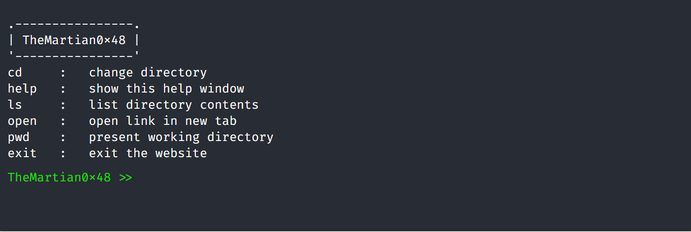

<p align="center">
  <h1 align="center">Web Terminal</h1>
  <p align="center">
      <b><i>A terminal for your website</i></b>
    <br />
  </p>
</p>




<p align="center">
       
  
</p>
<details open="open">
  <summary>Table of Contents</summary>
  <ul>
    <li>
      <a href="#introduction">Introduction</a>
      <ul>
        <li><a href="#technology">Technology</a></li>
      </ul>
    </li>
    <li>
      <a href="#getting-started">Getting Started</a>
      <ul>
        <li><a href="#step-1--add-css">Add CSS</a></li>
        <li><a href="#step-2--add-javascript">Add Javascript</a></li>
          <li><a href="#step-3--add-json">Add JSON</a></li>
          <li><a href="#step-4--add-html">Add HTML</a></li>
      </ul>
    </li>
    <li><a href="#creating-json">Creating JSON</a>
        <ul>
        <li><a href="#example">Example</a></li>
      </ul>
     </li>
  <li><a href="#styling-web-terminal">Styling Web Terminal</a></li>
  <li><a href="#adding-command">Adding Command</a></li>
    <li><a href="#license">License</a></li>
    <li><a href="#contact">Contact</a></li>
  </ul>
</details>


## Introduction

Web-Terminal is a limited-command supported terminal for websites. you can navigate website just like you can navigate directory in Linux, window or macOS using terminal.


### Technology
- [JavaScript](https://www.javascript.com/)
- [HTML](https://html.spec.whatwg.org/)
- [CSS](https://developer.mozilla.org/en-US/docs/Web/CSS)

## Getting Started

Integrating **web Terminal** in your website if very easy.  Since it uses only fundamental web-technology, you can add to your website build on any web framework and templates.

#### Step 1 : Add CSS

Add `web-terminal.css` to your website

#### Step 2 : Add javascript

Add `web-terminal.js`  to your website

#### Step 3 : Add JSON

First you have to creat json file with format defined in section [Creating JSON](#creating-json). After that, change variable `url` on the `line 3` in `web-terminal.js` so that it can point to THE json file.

#### step 4 : Add html

Finally add this html snippted to your website

```html
  <div id="web-terminal-window">
  </div>
  <script src="replace me">
  </script>
```

**Note** : replace `replace me` with url pointing to your `web-terminal.js`

## Creating JSON 

Format

- **user** : a string representing name of user, it will be shown left side of input field
- **root**: a dictionary contain infomation how directory tree should be created

```json
{
  "user": "TheMartian0x48",
  "root": {}
}
```

Each directory is a dictionary and must have following information

* **name** : a string representing name of directory
* **link** : a url to this directory, otherwise empty string
* **files** : a list of files in the directory
  * must have two element
  * first element must be name of the files
  * second element must  be a url to that file otherwise empty string 
* **children** : a list of directory which must specify its **name**, **link**, **files** and **children**

```json
"root" : {
    "name" : "/",
    "link" : "example.com",
    "files" : [["about", "example.com/about.html"]],
    "children" : [
        {
            "name" : "blog",
            "link" : "example.com/blog.html",
            "files" : [],
            "children" : []
        }
    ]
}
```

### Example

```json
{
  "user": "TheMartian0x48",
  "root": {
    "name": "/",
    "link": "https://themartian0x48.github.io/index.html",
    "files": [
      [
        "blog",
        "https://themartian0x48.github.io/pages/blog.html"
      ],
      [
        "project",
        "https://themartian0x48.github.io/pages/project.html"
      ],
      [
        "resume",
        "https://themartian0x48.github.io/pages/resume.html"
      ],
      [
        "about",
        "https://themartian0x48.github.io/pages/about.html"
      ]
    ],
    "children": [
      {
        "name": "adventure",
        "link": "https://themartian0x48.github.io/pages/adventure.html",
        "files": [
          [
            "Project-Euler",
            "https://themartian0x48.github.io/pages/adventure/project-euler.html"
          ],
          [
            "Bandit-by-OverTheWire",
            "https://themartian0x48.github.io/pages/adventure.html"
          ]
        ],
        "children": [
          {
            "name": "project-euler",
            "link": "https://themartian0x48.github.io/pages/adventure/project-euler.html",
            "files": [],
            "children": []
          }
        ]
      }
    ]
  }
}
```


## Styling Web Terminal

TODO

## Adding Command

Each command is a class which extend the `Command`class. 

`Command`class provide you with 

* `displayErrorMessage()` method : display error message
* `getName()` method : return name of the command

- `name` property: string representing name of the command
- `errorMessage` property: error message that will be shown on terminal if you call  `displayErrorMessage()` method

Your command must entend `Command` class and add `execute()` method.

```javascript
execute(filesystem, command){
    // your code
}
filesystem 
	- datatype : Tree object
	- reference to Tree representing current file structure
command 
	- datatype : string[]
	- list of command and it parameter
    Example for command 'open about'
	command = ["open", "about"]
```

your command class should be responsible for validation of paramters. 

finally, add an object of your command class to `terminal` object of `WebTerminal` which you will found at the end of `web-terminal.js` file.

## License

This project is using MIT License.

You have following permissions

- Commercial use
- Modification 
- Distribution 
- Private use 

For more detail, please read LICENSE.txt

## Contact

Drop a message on my [Twitter](https://twitter.com/TheMartian0x48) handle

